# Build an Autonomous News Agent in Copilot Studio

## 🧭 Lab Details

| Attribute | Value |
|-----------|-------|
| **Level** | Maker |
| **Persona** | Citizen Developer / Power Platform Maker |
| **Duration** | 20 minutes |
| **Purpose** | Create a scheduled agent that searches for news and emails a digest |

## 🤔 Why This Matters

Staying informed about industry trends, competitors, and market developments is critical but time-consuming. An autonomous news agent can:

- **Deliver insights proactively** without manual searches
- **Run on a schedule** so you never miss important updates
- **Format information consistently** as a polished newsletter
- **Scale across topics** by simply updating the instructions

## 🌐 What You'll Build

A Copilot Studio agent that runs on a recurring schedule, searches the web for news on topics you define, and emails you a formatted digest.

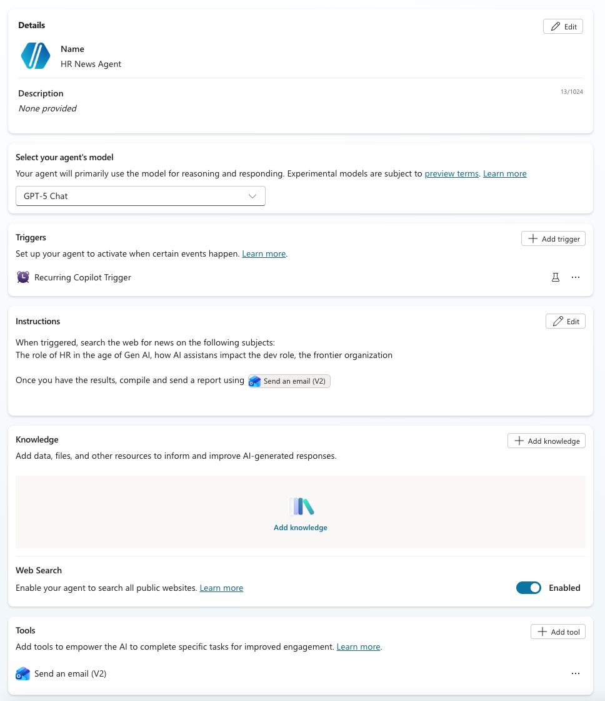

**Key components:**
- **Recurring Copilot Trigger** - Runs the agent on a schedule
- **Web Search** - Finds current news articles
- **Send an email (V2)** - Delivers the report to your inbox

## ✅ Prerequisites

- [ ] Access to [Microsoft Copilot Studio](https://copilotstudio.microsoft.com)
- [ ] A Power Platform developer environment (see below)
- [ ] Maker or higher permissions in the environment

---

## Step 0: Set Up a Developer Environment

Before building your agent, you need a Power Platform developer environment. This step checks if you have one and shows you how to create it if not.

### Check for an existing developer environment

1. Go to the [Power Platform admin center](https://admin.powerplatform.microsoft.com/environments)

2. Look at the **Type** column in your environments list

3. If you see an environment with type **Developer**, you're ready—skip to Step 1

### Create a developer environment

If you don't have a developer environment:

1. Click **+ New** in the toolbar

2. In the **New environment** panel, configure:

   | Field | Value |
   |-------|-------|
   | **Name** | Choose a name (e.g., `Dev Environment`) |
   | **Region** | Select your region |
   | **Type** | `Developer` |
   | **Purpose** | Optional description |

   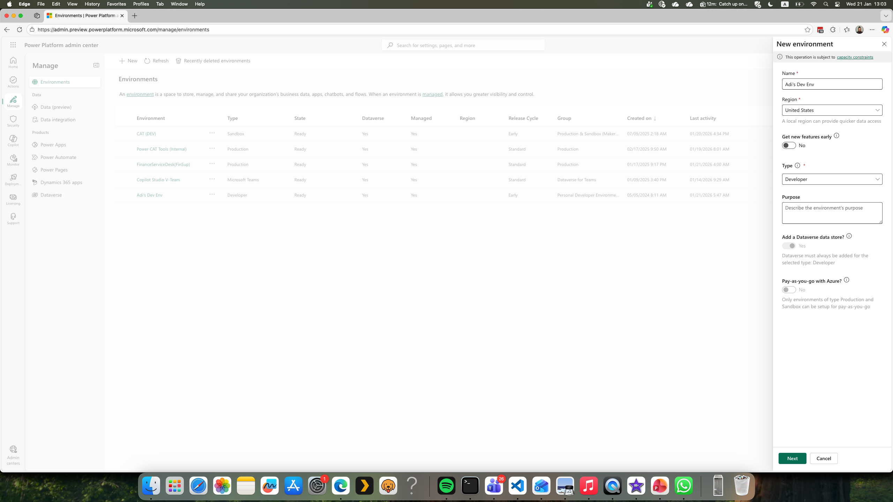

3. Click **Create**

4. Wait for the environment to be provisioned (this may take a few minutes)

{: .note }
> Developer environments are free and designed for building and testing solutions. They include Dataverse and are ideal for labs like this one.

---

## Step 1: Configure the Recurring Copilot Trigger

The Recurring Copilot Trigger runs your agent automatically on a schedule, without requiring user interaction.

### Add the trigger

1. In your agent, click **+ Add trigger** in the Triggers section

2. In the Add trigger dialog, select **Recurrence**

   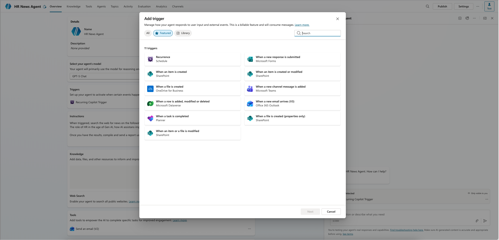

### Sign in to the connection

3. You'll be prompted to sign in. Click **Sign in** next to Microsoft Copilot Studio

   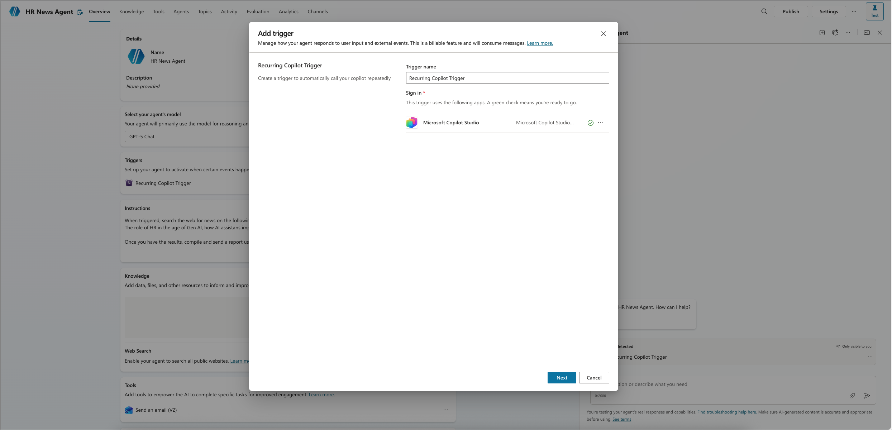

4. Complete the authentication flow in the popup window

### Configure the trigger

5. Configure the trigger settings:

   | Field | Value |
   |-------|-------|
   | **Trigger name** | `News Digest Trigger` (or your preference) |
   | **Trigger frequency** | Choose your schedule (e.g., Daily, Weekly) |

   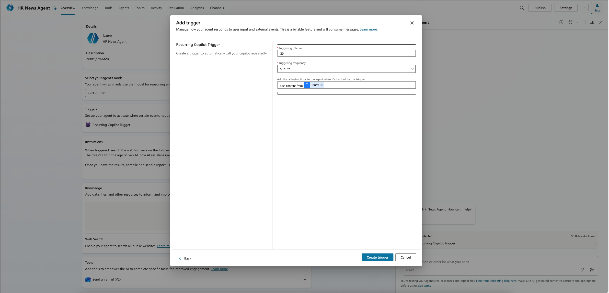

6. Click **Create trigger**

---

## Step 2: Add and Configure the Email Tool

The Send an email (V2) connector allows your agent to send the news digest to your inbox.

### Add the tool

1. Navigate to **Tools** in your agent

2. Click **+ Add tool**

3. Search for and select **Send an email (V2)** (Office 365 Outlook connector)

   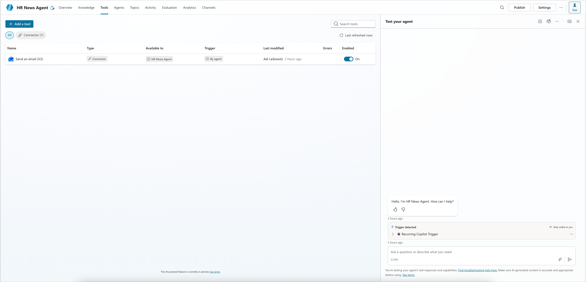

4. Sign in to the Office 365 Outlook connection if prompted

### Configure the inputs

The key to making this work autonomously is using **Dynamically fill with AI** for the email fields. This lets the agent decide what to put in each field based on your instructions.

5. Click on the **Send an email (V2)** tool to open its configuration

6. Navigate to **Inputs** in the left panel

7. Configure the **To** input:
   - Set **Fill using** to `Dynamically fill with AI`
   - Click **Customize** to open the input settings
   - Set **Description** to: `send to myself`

   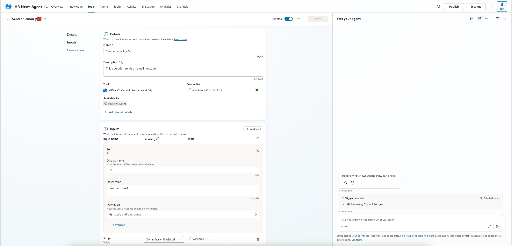

8. Configure the **Body** input:
   - Set **Fill using** to `Dynamically fill with AI`
   - Click **Customize** to open the input settings
   - Set **Description** to: `An HTML formatted report of relevant news, including links. Design the report like a visually appealing newsletter`

   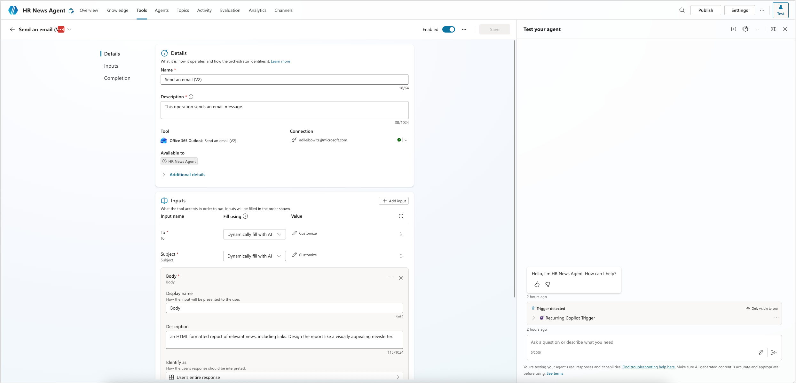

9. Click **Save**

{: .tip }
> The descriptions you provide guide the AI in filling these fields. Be specific about the format you want (HTML, newsletter-style) to get better results.

---

## Step 3: Write the Agent Instructions

The instructions tell your agent what to do when triggered. This is where you define the news topics and how to handle the results.

### Enable Web Search

1. In your agent's **Overview**, scroll to the **Knowledge** section

2. Ensure **Web Search** is toggled **Enabled**

### Write the instructions

3. Click **Edit** in the **Instructions** section

4. Enter instructions that define the topics to search for:

   ```
   When triggered, search the web for news on the following subjects:
   The role of HR in the age of Gen AI, how AI assistants impact the dev role, the frontier organization

   Once you have the results, compile and send a report using
   ```

5. To reference the email tool, type `/` to open the tool picker

   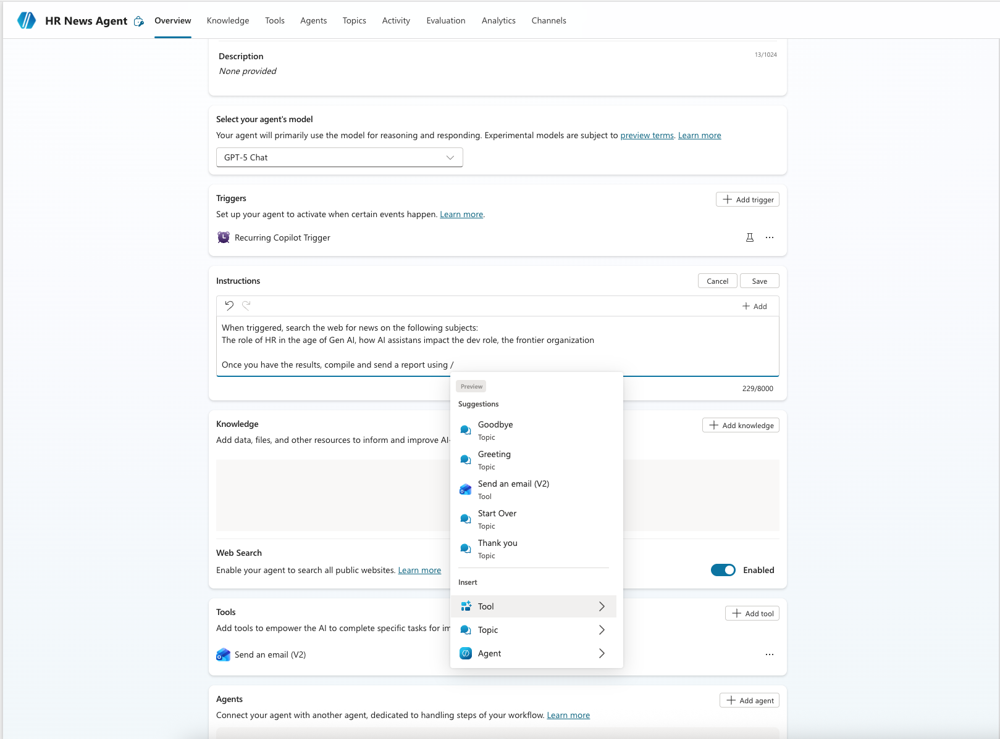

6. Select **Send an email (V2)** from the dropdown

   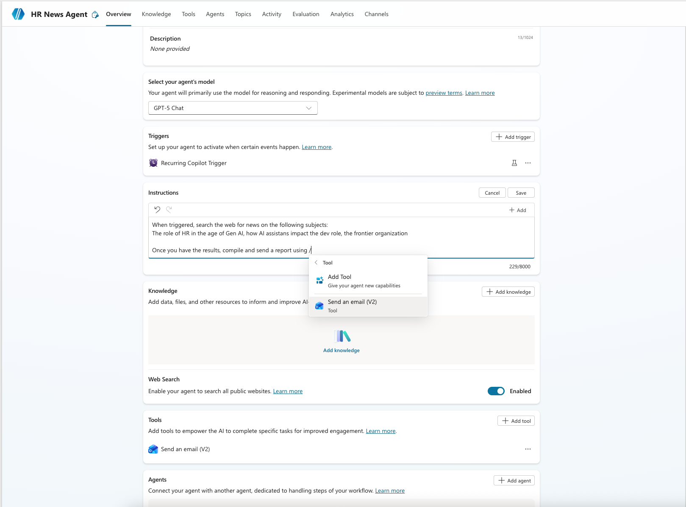

   This inserts a reference to the tool directly in your instructions.

7. Click **Save**

{: .note }
> You can customize the topics to anything relevant to your role. Consider industry trends, competitor names, technology updates, or market segments.

---

## Step 4: Test and Verify

Before relying on the scheduled trigger, test your agent manually to ensure everything works.

### Run a test

1. Click on the **Recurring Copilot Trigger** in the Triggers section

   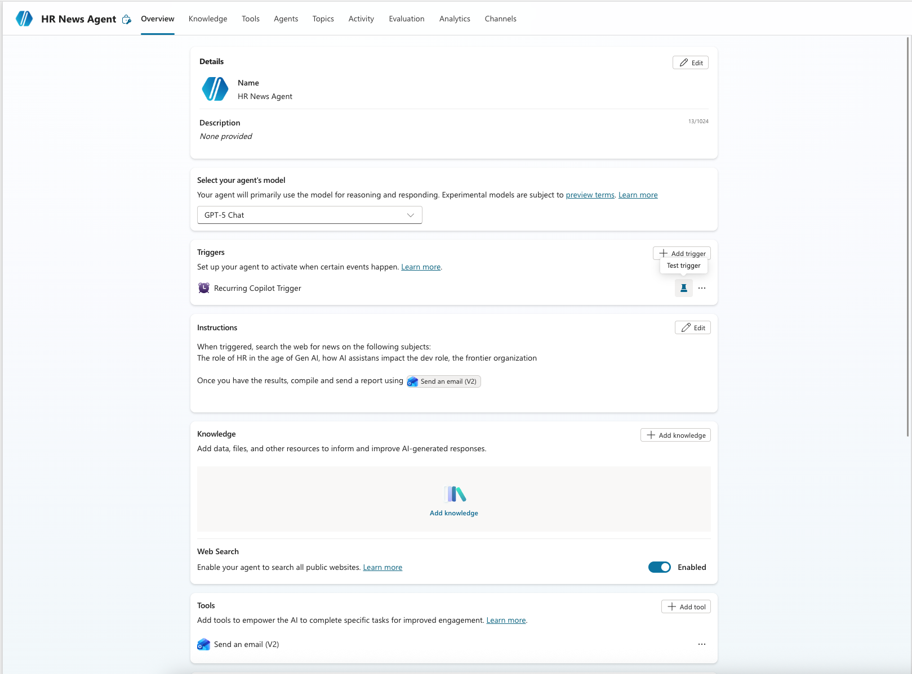

2. Click **Test your trigger** (or the test icon) to open the test dialog

3. In the **Test your trigger** dialog, you'll see the trigger schedule. Click **Start testing** to simulate a scheduled run

   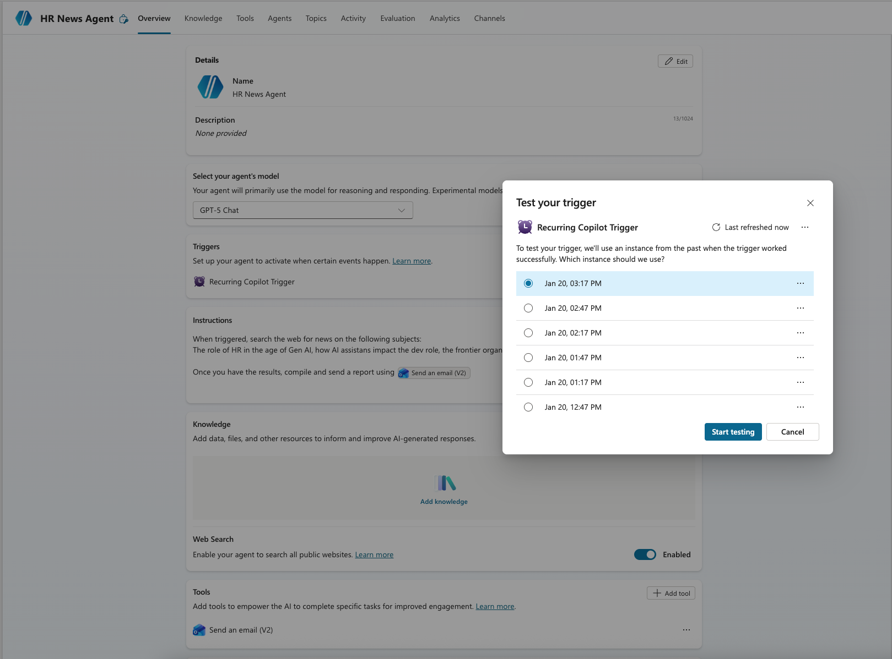

4. Wait for the agent to complete its work

### Review the activity map

5. Click on the activity to open the **Activity map**

6. Verify the execution flow:
   - Multiple **Search sources** steps (the agent searching for news)
   - **Send an email (V2)** step at the end

   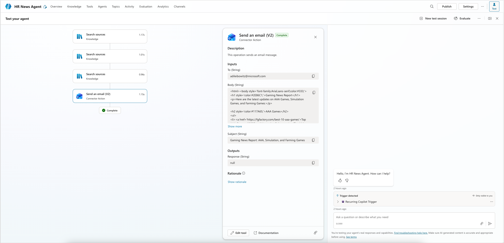

7. Click on the email step to see the output:
   - Check the **To** field has your email
   - Review the **Body** contains a formatted newsletter with links

8. Check your inbox for the actual email

   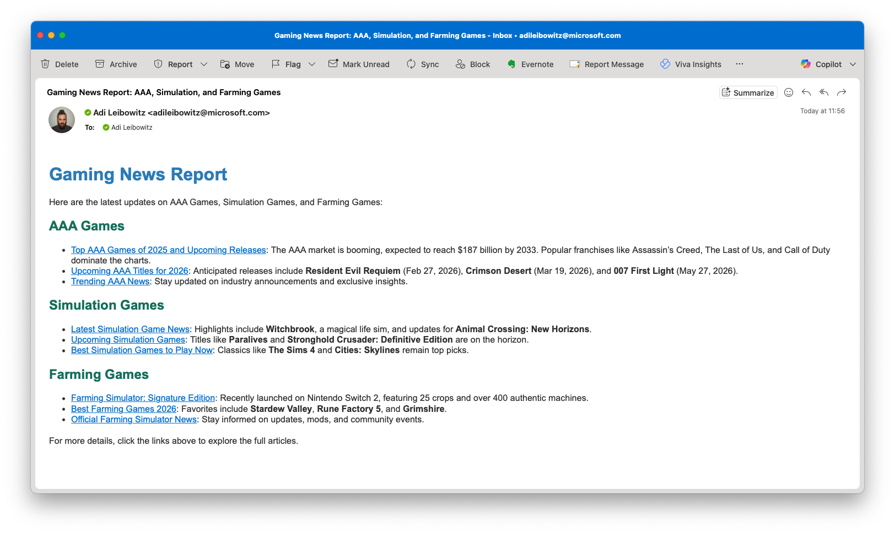

{: .tip }
> If the agent isn't searching the web, verify that:
> - Web Search is enabled in Knowledge
> - Your instructions mention searching for news

---

## 🎉 You Did It!

You've built an autonomous news agent that:

- ✅ Runs on a recurring schedule
- ✅ Searches the web for news on your chosen topics
- ✅ Compiles results into an HTML newsletter
- ✅ Emails the digest directly to you

### Publish your agent

When you're satisfied with the results, click **Publish** to activate the scheduled trigger.

### Ideas to extend

- **Add more topics** - Update instructions with additional subjects
- **Change the schedule** - Adjust trigger frequency (daily, weekly, etc.)
- **Different recipients** - Update the "To" description to send to a team alias
- **Add Teams integration** - Post the digest to a Teams channel instead of email
